# Jarkom-Modul-2-D27-2023

Anggota Kelompok Jarkom D27:
* Duevano Fairuz Pandya (5025211052)
* Choirul Rijal Dawam Iba (5025211206)

----------------------------------------------------------------------------------------------------------------------------------
**PREFIX: 10.35.X.X**

LOKASI SHELL SCRIPT / KONFIGURASI TIAP NOMOR:
1. topologi
2. node Yudhistira
3. node Yudhistira
4. node Yudhistira
5. node Yudhistira
6. node Yudhistira, node Werkudara
7. node Yudhistira, node Werkudara
8. node Werkudara
9. node Arjuna, node Prabukusuma, node Abimanyu, node Wisanggeni 
10. node Arjuna, node Prabukusuma, node Abimanyu, node Wisanggeni
11. node Abimanyu
12. node Abimanyu
13. node Abimanyu, node Yudhistira
14. node Abimanyu
15. node Abimanyu
16. node Abimanyu
17. node Abimanyu
18. node Abimanyu
19. node Abimanyu
20. node Abimanyu


----------------------------------------------------------------------------------------------------------------------------------
Revisi:
* hapus default page nginx dan apache2
* no9: di arjuna ditambahi servername 
* no11 keatas: apache2 set ke port 80 tok
* no14: dalam public harusnya gabisa diakses


----------------------------------------------------------------------------------------------------------------------------------
# No. 1
### Soal
Yudhistira akan digunakan sebagai DNS Master, Werkudara sebagai DNS Slave, Arjuna merupakan Load Balancer yang terdiri dari beberapa Web Server yaitu Prabakusuma, Abimanyu, dan Wisanggeni. Buatlah topologi dengan pembagian sebagai berikut. Folder topologi dapat diakses pada drive berikut 

### Penyelesaian


-tambahin penjelasan singkat jal-

Kendala: tidak ada

----------------------------------------------------------------------------------------------------------------------------------
# No. 2
### Soal
Buatlah website utama pada node arjuna dengan akses ke arjuna.yyy.com dengan alias www.arjuna.yyy.com dengan yyy merupakan kode kelompok.

### Penyelesaian


-tambahin penjelasan singkat jal-

### Output

-tambahin penjelasan singkat jal-

Kendala:


----------------------------------------------------------------------------------------------------------------------------------
# No. 3
### Soal
Dengan cara yang sama seperti soal nomor 2, buatlah website utama dengan akses ke abimanyu.yyy.com dan alias www.abimanyu.yyy.com.

### Penyelesaian


-tambahin penjelasan singkat jal-

### Output

-tambahin penjelasan singkat jal-

Kendala: 

----------------------------------------------------------------------------------------------------------------------------------
# No. 4
### Soal
Kemudian, karena terdapat beberapa web yang harus di-deploy, buatlah subdomain parikesit.abimanyu.yyy.com yang diatur DNS-nya di Yudhistira dan mengarah ke Abimanyu.

### Penyelesaian


-tambahin penjelasan singkat jal-

### Output

-tambahin penjelasan singkat jal-

Kendala: 

----------------------------------------------------------------------------------------------------------------------------------
# No. 5
### Soal
Buat juga reverse domain untuk domain utama. (Abimanyu saja yang direverse)

### Penyelesaian


* Kita lakukan pengaturan konfig di node Yudhistira,
* echo yang pertama digunakan untuk mengatur konfig deklarasi dns di `/etc/bind/named.conf.local`
* cp `/etc/bind/db.local` sebagai template bind konfig reverse domain abimanyu.d27.com (`3.35.10.in-addr.arpa`)

### Output


Kendala: tidak ada


----------------------------------------------------------------------------------------------------------------------------------
# No. 6
### Soal
Agar dapat tetap dihubungi ketika DNS Server Yudhistira bermasalah, buat juga Werkudara sebagai DNS Slave untuk domain utama.

### Penyelesaian
Untuk nomor 6, script penyelesaian dibuat di node Yudhistira dan Werkudara.

Node Yudhistira:


Node Werkudara:


* konfigurasi di atas dilakukan untuk membuat dns yudhistira sebagai master dan werkudara sebagai slave nya
* pada yudhistira terdapat tambahan 
```
        type master;
        notify yes;
        also-notify { 10.35.1.2; }; 
        allow-transfer { 10.35.1.2; };
```
* dan apda werkudara terdapat tambahan 
```
        type slave;
        masters { 10.35.1.3;}; // IP Yudhistira
```

### Output


Kendala: tidak ada


----------------------------------------------------------------------------------------------------------------------------------
# No. 7
### Soal
Seperti yang kita tahu karena banyak sekali informasi yang harus diterima, buatlah subdomain khusus untuk perang yaitu baratayuda.abimanyu.yyy.com dengan alias www.baratayuda.abimanyu.yyy.com yang didelegasikan dari Yudhistira ke Werkudara dengan IP menuju ke Abimanyu dalam folder Baratayuda.

### Penyelesaian
Untuk melakukan delegasi nama domain diperlukan konfig untuk dua node yang ingin disambungkan. Konfigurasi dibuat di node Yudhistira dan Werkudara

Node Yudhistira:


Node Werkudara:


* pendelegasian dilakukan dengan cara menambahkan 
```
ns1     IN      A       10.35.1.2       ; IP Werkudara
baratayuda      IN      NS      ns1
```
* dan dilakukan konfig berikut pada `/etc/bind/named.conf.options`
```
        // dnssec-validation auto;
        allow-query{any;};
``` 
* selain itu pada node werkudara juga ditambahkan konfig deklarasi dns `baratayuda.abimanyu.d27.com` dengan tipe master, dan konfig bind nya juga sebagaimana pembuatan domain biasanya


### Output


Kendala: tidak ada

----------------------------------------------------------------------------------------------------------------------------------
# No. 8
### Soal
Untuk informasi yang lebih spesifik mengenai Ranjapan Baratayuda, buatlah subdomain melalui Werkudara dengan akses rjp.baratayuda.abimanyu.yyy.com dengan alias www.rjp.baratayuda.abimanyu.yyy.com yang mengarah ke Abimanyu.

### Penyelesaian
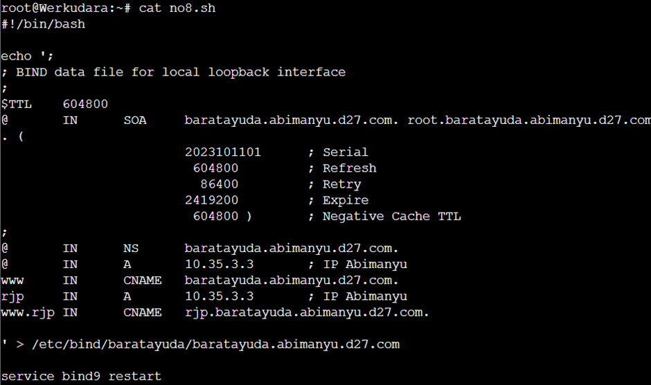

* pembuatan subdomain `rjp.baratayuda.abimanyu.d27.com`dilakukan dengan cara menambahkan 
```
rjp     IN      A       10.35.3.3       ; IP Abimanyu
www.rjp IN      CNAME   rjp.baratayuda.abimanyu.d27.com.
```

### Output
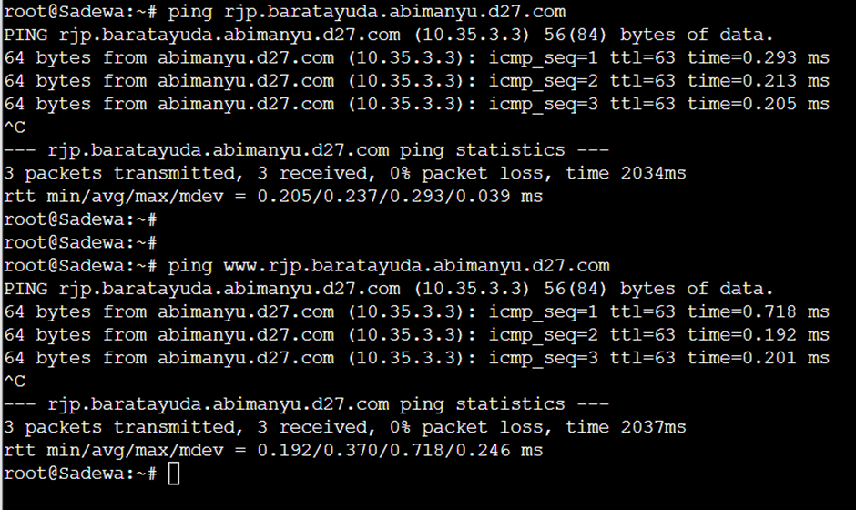

Kendala: tidak ada


----------------------------------------------------------------------------------------------------------------------------------
# No. 9
### Soal
Arjuna merupakan suatu Load Balancer Nginx dengan tiga worker (yang juga menggunakan nginx sebagai webserver) yaitu Prabakusuma, Abimanyu, dan Wisanggeni. Lakukan deployment pada masing-masing worker.

# No. 10
### Soal
Kemudian gunakan algoritma Round Robin untuk Load Balancer pada Arjuna. Gunakan server_name pada soal nomor 1. Untuk melakukan pengecekan akses alamat web tersebut kemudian pastikan worker yang digunakan untuk menangani permintaan akan berganti ganti secara acak. Untuk webserver di masing-masing worker wajib berjalan di port 8001-8003. Contoh
    - Prabakusuma:8001
    - Abimanyu:8002
    - Wisanggeni:8003

### Penyelesaian
Untuk nomor 9 dan 10, saya kerjakan bersamaan jadi akan lebih baik jika digabung penyelesaiannya. Berikut ini adalah konfig masing-masing node dalam kasus load balancing:

Node Arjuna:
```sh
#!/bin/bash

touch /etc/nginx/sites-available/lb-arjuna
echo '# Default menggunakan Round Robin
upstream myweb  {
        server 10.35.3.4:8001; #IP Prabukusuma
        server 10.35.3.3:8002; #IP Abimanyu
        server 10.35.3.2:8003; #IP Wisanggeni
}

server {
        listen 80;
        server_name arjuna.d27.com www.arjuna.d27.com;

        location / {
        proxy_pass http://myweb;
        }
}
' > /etc/nginx/sites-available/lb-arjuna

ln -s /etc/nginx/sites-available/lb-arjuna /etc/nginx/sites-enabled

service nginx restart
```

Node Wisanggeni:
```sh
#!/bin/bash

mkdir /var/www/arjuna

touch /var/www/arjuna/index.php
echo '<?php
        echo "Halo, Kamu akses arjuna.d27.com melalui worker node WISANGGENI";
        $hostname = gethostname();
        $date = date("Y-m-d H:i:s");
        $php_version = phpversion();
        $username = get_current_user();

        echo "Hello World!<br>";
        echo "Saya adalah: $username<br>";
        echo "Saat ini berada di: $hostname<br>";
        echo "Versi PHP yang saya gunakan: $php_version<br>";
        echo "Tanggal saat ini: $date<br>";
?>
' > /var/www/arjuna/index.php

touch /etc/nginx/sites-available/arjuna
echo ' server {

        listen 8003;

        root /var/www/arjuna;

        index index.php index.html index.htm;
        server_name arjuna.d27.com;

        location / {
                        try_files $uri $uri/ /index.php?$query_string;
        }

        # pass PHP scripts to FastCGI server
        location ~ \.php$ {
        include snippets/fastcgi-php.conf;
        fastcgi_pass unix:/var/run/php/php7.0-fpm.sock;
        }

 location ~ /\.ht {
                        deny all;
        }

        error_log /var/log/nginx/arjuna_error.log;
        access_log /var/log/nginx/arjuna_access.log;
 }
' > /etc/nginx/sites-available/arjuna

ln -s /etc/nginx/sites-available/arjuna /etc/nginx/sites-enabled

service nginx restart

service php7.0-fpm start
```

Node Abimanyu:
```sh
#!/bin/bash

mkdir /var/www/arjuna

touch /var/www/arjuna/index.php
echo '<?php
        echo "Halo, Kamu akses arjuna.d27.com melalui worker node ABIMANYU";
        $hostname = gethostname();
        $date = date("Y-m-d H:i:s");
        $php_version = phpversion();
        $username = get_current_user();

        echo "Hello World!<br>";
        echo "Saya adalah: $username<br>";
        echo "Saat ini berada di: $hostname<br>";
        echo "Versi PHP yang saya gunakan: $php_version<br>";
        echo "Tanggal saat ini: $date<br>";
?>
' > /var/www/arjuna/index.php

touch /etc/nginx/sites-available/arjuna
echo ' server {

        listen 8002;

        root /var/www/arjuna;

        index index.php index.html index.htm;
        server_name arjuna.d27.com;

        location / {
                        try_files $uri $uri/ /index.php?$query_string;
        }

        # pass PHP scripts to FastCGI server
        location ~ \.php$ {
        include snippets/fastcgi-php.conf;
        fastcgi_pass unix:/var/run/php/php7.0-fpm.sock;
        }

 location ~ /\.ht {
                        deny all;
        }

        error_log /var/log/nginx/arjuna_error.log;
        access_log /var/log/nginx/arjuna_access.log;
 }
' > /etc/nginx/sites-available/arjuna

ln -s /etc/nginx/sites-available/arjuna /etc/nginx/sites-enabled

rm /etc/nginx/sites-available/default
rm /etc/nginx/sites-enabled/default

service nginx restart

service php7.0-fpm start
```

Node Prabukusuma:
```sh
#!/bin/bash

mkdir /var/www/arjuna

touch /var/www/arjuna/index.php
echo '<?php
        echo "Halo, Kamu akses arjuna.d27.com melalui worker node PRABUKUSUMA";
        $hostname = gethostname();
        $date = date("Y-m-d H:i:s");
        $php_version = phpversion();
        $username = get_current_user();

        echo "Hello World!<br>";
        echo "Saya adalah: $username<br>";
        echo "Saat ini berada di: $hostname<br>";
        echo "Versi PHP yang saya gunakan: $php_version<br>";
        echo "Tanggal saat ini: $date<br>";
?>
' > /var/www/arjuna/index.php

touch /etc/nginx/sites-available/arjuna
echo ' server {

        listen 8001;

        root /var/www/arjuna;

        index index.php index.html index.htm;
        server_name arjuna.d27.com;

        location / {
                        try_files $uri $uri/ /index.php?$query_string;
        }

        # pass PHP scripts to FastCGI server
        location ~ \.php$ {
        include snippets/fastcgi-php.conf;
        fastcgi_pass unix:/var/run/php/php7.0-fpm.sock;
        }

 location ~ /\.ht {
                        deny all;
        }

        error_log /var/log/nginx/arjuna_error.log;
        access_log /var/log/nginx/arjuna_access.log;
 }
' > /etc/nginx/sites-available/arjuna

ln -s /etc/nginx/sites-available/arjuna /etc/nginx/sites-enabled

service nginx restart

service php7.0-fpm start
```
* prabukusuma, abimanyu, dan wisanggeni secara berturut-turut akan menggunakan port 8001, 8002, dan 8003
* setiap port diatur pada bagian `<virtual host>`
* kemudian tidak lupa untuk menghapus sites-enable default miliki node Abimanyu karena nantinya port default akan dipakai oleh nomor 11 keatas untuk deploy apache2
* di arjuna juga ditambahkan ip beserta port masing-masing worker
* di arjuna juga ditambahkan servername yang sesuai yakni `server_name arjuna.d27.com www.arjuna.d27.com;`


### Output
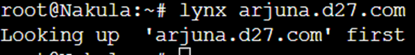
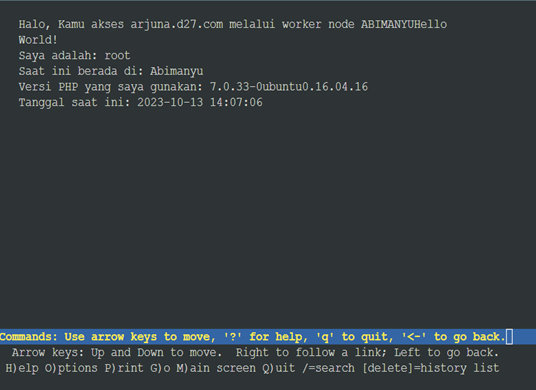
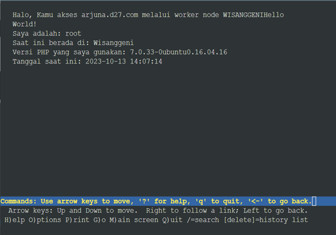
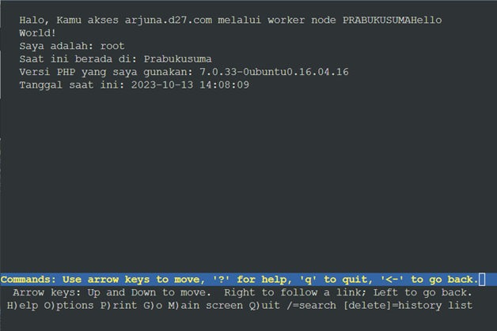

Kendala: 
* tidak bisa menjalan nginx dan apache2 bersamaan karena masalah port default 80 yang terpakai (SUDAH DIREVISI)
* tidak bisa bing ke `www.arjuna.d27.com` (SUDAH DIREVISI)

----------------------------------------------------------------------------------------------------------------------------------
# No. 11
### Soal
Selain menggunakan Nginx, lakukan konfigurasi Apache Web Server pada worker Abimanyu dengan web server www.abimanyu.yyy.com. Pertama dibutuhkan web server dengan DocumentRoot pada /var/www/abimanyu.yyy

### Penyelesaian
Untuk melakukan pendeploy-an menggunakan apache, saya menggunakan template dasar yang sudah ada di modul.
script no11:
```sh
#!/bin/bash

cp /etc/apache2/sites-available/000-default.conf /etc/apache2/sites-available/default-8002.conf

echo "<VirtualHost *:80>
        # The ServerName directive sets the request scheme, hostname and port that
        # the server uses to identify itself. This is used when creating
        # redirection URLs. In the context of virtual hosts, the ServerName
        # specifies what hostname must appear in the request's Host: header to
        # match this virtual host. For the default virtual host (this file) this
        # value is not decisive as it is used as a last resort host regardless.
        # However, you must set it for any further virtual host explicitly.
        #ServerName www.example.com

        ServerAdmin webmaster@localhost
        DocumentRoot /var/www/abimanyu.d27
        ServerName abimanyu.d27.com
        ServerAlias www.abimanyu.d27.com

        # Available loglevels: trace8, ..., trace1, debug, info, notice, warn,
        # error, crit, alert, emerg.
        # It is also possible to configure the loglevel for particular
        # modules, e.g.
        #LogLevel info ssl:warn

        ErrorLog \${APACHE_LOG_DIR}/error.log
        CustomLog \${APACHE_LOG_DIR}/access.log combined

        # For most configuration files from conf-available/, which are
        # enabled or disabled at a global level, it is possible to
        # include a line for only one particular virtual host. For example the
        # following line enables the CGI configuration for this host only
        # after it has been globally disabled with "a2disconf".
        #Include conf-available/serve-cgi-bin.conf
</VirtualHost>

# vim: syntax=apache ts=4 sw=4 sts=4 sr noet
" > /etc/apache2/sites-available/default-8002.conf

echo "
# If you just change the port or add more ports here, you will likely also
# have to change the VirtualHost statement in
# /etc/apache2/sites-enabled/000-default.conf

Listen 80

<IfModule ssl_module>
        Listen 443
</IfModule>

<IfModule mod_gnutls.c>
        Listen 443
</IfModule>

# vim: syntax=apache ts=4 sw=4 sts=4 sr noet
" > /etc/apache2/ports.conf

a2ensite default-8002.conf

service apache2 restart

mkdir /var/www/abimanyu.d27

touch /var/www/abimanyu.d27/index.php
echo "
<?php
        if(\$_SERVER['REQUEST_URI'] == '/index.php/home' || \$_SERVER['REQUEST_URI'] == '/home' || \$_SERVER['REQUEST_URI'] == '/index.php' || \$_SERVER['REQUEST_URI'] == '/') readfile('home.html');
        else http_response_code(404);
?>
" > /var/www/abimanyu.d27/index.php

touch /var/www/abimanyu.d27/home.html
echo "
<!DOCTYPE html>
<html lang="en">

<head>
    <meta charset="UTF-8">
    <meta http-equiv="X-UA-Compatible" content="IE=edge">
    <meta name="viewport" content="width=device-width, initial-scale=1.0">
    <link rel="stylesheet" href="https://maxcdn.bootstrapcdn.com/bootstrap/4.0.0/css/bootstrap.min.css" integrity="sha384-Gn5384xqQ1aoWXA+058RXPxPg6fy4IWvTNh0E263XmFcJlSAwiGgFAW/dAiS6JXm" crossorigin="anonymous">
    <title>WISE's Best Agent</title>
    <style>
        html,body{
            background-image: url('abimanyu.webp');
            background-repeat: no-repeat;
            background-size: 100% 100%;
            height: 100%;
            width: 100%;
        }
        
        h1,h2 {
            text-align: center;
            color: black;
            font-weight: bold;
            -webkit-text-stroke-width: 1px;
            -webkit-text-stroke-color: black;
        }
    </style>
</head>

<body>
    <h1>Hohoho!!!</h3>
    <h2>Akulah Abimanyu</h4>
</body>

</html>
" > /var/www/abimanyu.d27/home.html

wget -O /var/www/abimanyu.d27/abimanyu.webp "https://drive.usercontent.google.com/download?id=1YxhEAz6HO0h3WTfUvVClk09S1UI-M2kE&export=download&authuser=0&confirm=t&uuid=3f5c5b19-2a9a-4f19-9a08-dc1ba4681157&at=APZUnTUt0fyr8uEA7f-k2pLDfVP2:1697038192804"

service apache2 restart
```

* disini saya sedikit melakukan kesalahan dengan menamai konfig `sites-available` nya dengan nama `default-8002.conf` padahal port 8002 tidak digunakan di konfigurasi ini, tetapi konfig dapat berjalan dengan baik setelah dilakukan REVISI
* selebihnya konfigurasi mengambil referensi dari modul dan cukup menambahkan sedikit perubahan yang diperlukan 


### Output
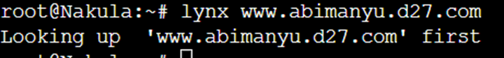
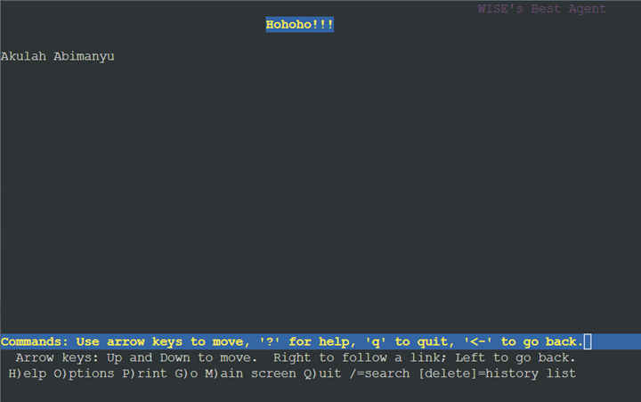

Kendala:
* sebelumnya saya menambahkan dua virtual host yang mana ternyata mubazir untuk kasus ini
* service apache2 tidak bisa dinyalakan karena nginx merebut port default 80 (SUDAH DIREVISI)

----------------------------------------------------------------------------------------------------------------------------------
# No. 12
### Soal
Setelah itu ubahlah agar url www.abimanyu.yyy.com/index.php/home menjadi www.abimanyu.yyy.com/home.

### Penyelesaian
isi script no12:
```sh
#!/bin/bash

a2enmod rewrite
service apache2 restart


touch /var/www/abimanyu.d27/.htaccess
echo "
RewriteEngine On
RewriteBase /

# Check if the request is not for a valid file or directory.
RewriteCond %{REQUEST_FILENAME} !-f
RewriteCond %{REQUEST_FILENAME} !-d

# Rewrite the user-friendly URL to the actual script.
RewriteRule ^(.*)\$ index.php/\$1 [L]

" > /var/www/abimanyu.d27/.htaccess

echo "<VirtualHost *:80>
        # The ServerName directive sets the request scheme, hostname and port that
        # the server uses to identify itself. This is used when creating
        # redirection URLs. In the context of virtual hosts, the ServerName
        # specifies what hostname must appear in the request's Host: header to
        # match this virtual host. For the default virtual host (this file) this
        # value is not decisive as it is used as a last resort host regardless.
        # However, you must set it for any further virtual host explicitly.
        #ServerName www.example.com

        ServerAdmin webmaster@localhost
        DocumentRoot /var/www/abimanyu.d27
        ServerName abimanyu.d27.com
        ServerAlias www.abimanyu.d27.com

        <Directory /var/www/abimanyu.d27>
                Options +FollowSymLinks -Multiviews
                AllowOverride All
        </Directory>

        # Available loglevels: trace8, ..., trace1, debug, info, notice, warn,
        # error, crit, alert, emerg.
        # It is also possible to configure the loglevel for particular
        # modules, e.g.
        #LogLevel info ssl:warn

        ErrorLog \${APACHE_LOG_DIR}/error.log
        CustomLog \${APACHE_LOG_DIR}/access.log combined

        # For most configuration files from conf-available/, which are
        # enabled or disabled at a global level, it is possible to
        # include a line for only one particular virtual host. For example the
        # following line enables the CGI configuration for this host only
        # after it has been globally disabled with "a2disconf".
        #Include conf-available/serve-cgi-bin.conf
</VirtualHost>

# vim: syntax=apache ts=4 sw=4 sts=4 sr noet
" > /etc/apache2/sites-available/default-8002.conf

service apache2 restart
```

* menambahkan file `.htaccess` ke direktori `/var/www/abimanyu.d27/`
* isi file `.htaccess` yakni 
```
RewriteEngine On
RewriteBase /

# Check if the request is not for a valid file or directory.
RewriteCond %{REQUEST_FILENAME} !-f
RewriteCond %{REQUEST_FILENAME} !-d

# Rewrite the user-friendly URL to the actual script.
RewriteRule ^(.*)\$ index.php/\$1 [L]
```
* menambahkan sedikit konfig di virtualhost 
```
        <Directory /var/www/abimanyu.d27>
                Options +FollowSymLinks -Multiviews
                AllowOverride All
        </Directory>
```

### Output
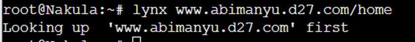
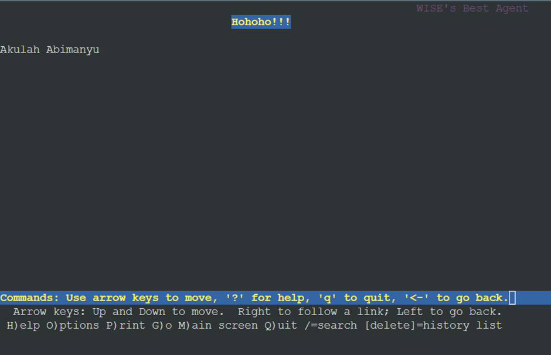

Kendala: tidak ada

----------------------------------------------------------------------------------------------------------------------------------
# No. 13
### Soal
Selain itu, pada subdomain www.parikesit.abimanyu.yyy.com, DocumentRoot disimpan pada /var/www/parikesit.abimanyu.yyy

### Penyelesaian
untuk menjawab nomor ini diperlukan konfig di node abimanyu dan node yudhistira

Node Abimanyu:
```sh
#!/bin/bash

cp /etc/apache2/sites-available/000-default.conf /etc/apache2/sites-available/default-parikesit.conf

echo "<VirtualHost *:80>
        # The ServerName directive sets the request scheme, hostname and port that
        # the server uses to identify itself. This is used when creating
        # redirection URLs. In the context of virtual hosts, the ServerName
        # specifies what hostname must appear in the request's Host: header to
        # match this virtual host. For the default virtual host (this file) this
        # value is not decisive as it is used as a last resort host regardless.
        # However, you must set it for any further virtual host explicitly.
        #ServerName www.example.com

        ServerAdmin webmaster@localhost
        DocumentRoot /var/www/parikesit.abimanyu.d27
        ServerName parikesit.abimanyu.d27.com
        ServerAlias www.parikesit.abimanyu.d27.com

        # Available loglevels: trace8, ..., trace1, debug, info, notice, warn,
        # error, crit, alert, emerg.
        # It is also possible to configure the loglevel for particular
        # modules, e.g.
        #LogLevel info ssl:warn

        ErrorLog \${APACHE_LOG_DIR}/error.log
        CustomLog \${APACHE_LOG_DIR}/access.log combined

        # For most configuration files from conf-available/, which are
        # enabled or disabled at a global level, it is possible to
        # include a line for only one particular virtual host. For example the
        # following line enables the CGI configuration for this host only
        # after it has been globally disabled with "a2disconf".
        #Include conf-available/serve-cgi-bin.conf
</VirtualHost>

# vim: syntax=apache ts=4 sw=4 sts=4 sr noet
" > /etc/apache2/sites-available/default-parikesit.conf

a2ensite default-parikesit.conf

mkdir /var/www/parikesit.abimanyu.d27

service apache2 restart

#wget -O /var/www/parikesit.abimanyu.d27/parikesit.zip "https://drive.google.com/uc?export=download&id=1x2HNFDyvA2l7JfPQlI6rXRnorcwvz7EH" && unzip /var/www/parikesit.abimanyu.d27/parikesit.zip

# URL and destination path
url="https://drive.google.com/uc?export=download&id=1x2HNFDyvA2l7JfPQlI6rXRnorcwvz7EH"
dest="/var/www/parikesit.abimanyu.d27/parikesit.zip"

# Download the file
wget -O "$dest" "$url"

# Check if the file exists and has a non-zero size
while [ ! -s "$dest" ]
do
  sleep 5  # Wait for 5 seconds and check again
done

# Once the file is downloaded and has content, unzip it
unzip "$dest" -d /var/www/parikesit.abimanyu.d27/

service nginx stop
service apache2 restart
```

Node Yudhistira:

```sh
#!/bin/bash

echo ";
; BIND data file for local loopback interface
;
\$TTL    604800
@       IN      SOA     abimanyu.d27.com. root.abimanyu.d27.com. (
                        2023101001      ; Serial
                         604800         ; Refresh
                          86400         ; Retry
                        2419200         ; Expire
                         604800 )       ; Negative Cache TTL
;
@       IN      NS      abimanyu.d27.com.
@       IN      A       10.35.3.3       ; IP Abimanyu
www     IN      CNAME   abimanyu.d27.com.
parikesit       IN      A       10.35.3.3       ; IP Abimanyu
www.parikesit   IN      CNAME   parikesit.abimanyu.d27.com.
ns1     IN      A       10.35.1.2       ; IP Werkudara
baratayuda      IN      NS      ns1
@       IN      AAAA    ::1
" > /etc/bind/jarkom/abimanyu.d27.com

service bind9 restart
```

* pada setup webserver `www.parikesit.abimanyu.d27.com` ini saya mencoba cara yang lebih mudah untuk menambahkan laman yang diinginkan dengan cara wget zip lalu ekstrak zip
* disini untuk file zip saya biarkan ada di `/var/www/parikesit.abimanyu.d27`
* selebihnya saya mengambil template dari modul dengan melakukan sedikit perubahan yang diinginkan seperti `<virtualhost>`, penambahan konfig bind untuk parikesit


### Output
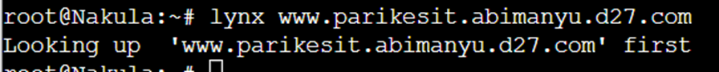
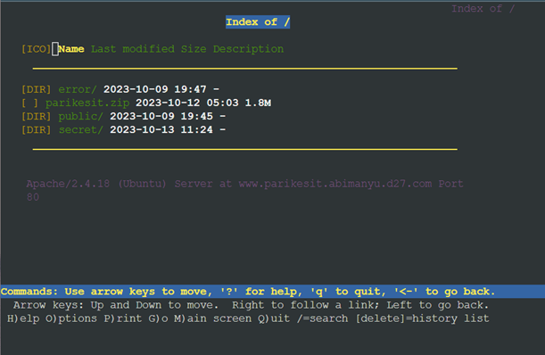

Kendala: tidak ada

----------------------------------------------------------------------------------------------------------------------------------
# No. 14
### Soal
Pada subdomain tersebut folder /public hanya dapat melakukan directory listing sedangkan pada folder /secret tidak dapat diakses (403 Forbidden).

### Penyelesaian
isi script no14:
```sh
#!/bin/bash

mkdir /var/www/parikesit.abimanyu.d27/secret

echo "<VirtualHost *:80>
        # The ServerName directive sets the request scheme, hostname and port that
        # the server uses to identify itself. This is used when creating
        # redirection URLs. In the context of virtual hosts, the ServerName
        # specifies what hostname must appear in the request's Host: header to
        # match this virtual host. For the default virtual host (this file) this
        # value is not decisive as it is used as a last resort host regardless.
        # However, you must set it for any further virtual host explicitly.
        #ServerName www.example.com

        ServerAdmin webmaster@localhost
        DocumentRoot /var/www/parikesit.abimanyu.d27
        ServerName parikesit.abimanyu.d27.com
        ServerAlias www.parikesit.abimanyu.d27.com

        <Directory /var/www/parikesit.abimanyu.d27/public>
                Options +Indexes
        </Directory>

        <Directory /var/www/parikesit.abimanyu.d27/public/css>
                Options -Indexes
        </Directory>

        <Directory /var/www/parikesit.abimanyu.d27/public/images>
                Options -Indexes
        </Directory>

        <Directory /var/www/parikesit.abimanyu.d27/public/js>
                Options -Indexes
        </Directory>

        <Directory /var/www/parikesit.abimanyu.d27/secret>
                Options -Indexes
        </Directory>

        # Available loglevels: trace8, ..., trace1, debug, info, notice, warn,
        # error, crit, alert, emerg.
        # It is also possible to configure the loglevel for particular
        # modules, e.g.
        #LogLevel info ssl:warn

        ErrorLog \${APACHE_LOG_DIR}/error.log
        CustomLog \${APACHE_LOG_DIR}/access.log combined

        # For most configuration files from conf-available/, which are
        # enabled or disabled at a global level, it is possible to
        # include a line for only one particular virtual host. For example the
        # following line enables the CGI configuration for this host only
        # after it has been globally disabled with "a2disconf".
        #Include conf-available/serve-cgi-bin.conf
</VirtualHost>

# vim: syntax=apache ts=4 sw=4 sts=4 sr noet
" > /etc/apache2/sites-available/default-parikesit.conf

service apache2 restart
```
* penambahan konfig berikut untuk izin penampilan dir listing nya
```
        <Directory /var/www/parikesit.abimanyu.d27/public>
                Options +Indexes
        </Directory>

        <Directory /var/www/parikesit.abimanyu.d27/public/css>
                Options -Indexes
        </Directory>

        <Directory /var/www/parikesit.abimanyu.d27/public/images>
                Options -Indexes
        </Directory>

        <Directory /var/www/parikesit.abimanyu.d27/public/js>
                Options -Indexes
        </Directory>

        <Directory /var/www/parikesit.abimanyu.d27/secret>
                Options -Indexes
        </Directory>
```


### Output
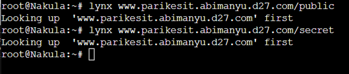
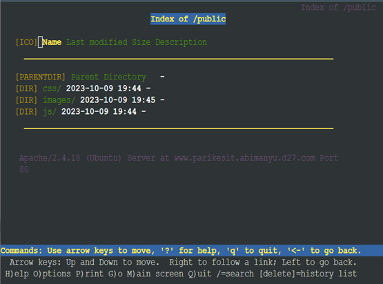


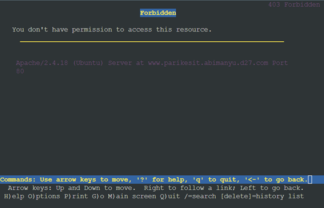

Kendala:
* direktori di dalam publik seperti `images, css, dan js` masih bisa dibuka (SUDAH DIREVISI) 

----------------------------------------------------------------------------------------------------------------------------------
# No. 15
### Soal
Buatlah kustomisasi halaman error pada folder /error untuk mengganti error kode pada Apache. Error kode yang perlu diganti adalah 404 Not Found dan 403 Forbidden.

### Penyelesaian
isi script no15:
```sh
#!/bin/bash

echo "<VirtualHost *:80>
        # The ServerName directive sets the request scheme, hostname and port that
        # the server uses to identify itself. This is used when creating
        # redirection URLs. In the context of virtual hosts, the ServerName
        # specifies what hostname must appear in the request's Host: header to
        # match this virtual host. For the default virtual host (this file) this
        # value is not decisive as it is used as a last resort host regardless.
        # However, you must set it for any further virtual host explicitly.
        #ServerName www.example.com

        ServerAdmin webmaster@localhost
        DocumentRoot /var/www/parikesit.abimanyu.d27
        ServerName parikesit.abimanyu.d27.com
        ServerAlias www.parikesit.abimanyu.d27.com

        <Directory /var/www/parikesit.abimanyu.d27/public>
                Options +Indexes
        </Directory>

        <Directory /var/www/parikesit.abimanyu.d27/public/css>
                Options -Indexes
        </Directory>

        <Directory /var/www/parikesit.abimanyu.d27/public/images>
                Options -Indexes
        </Directory>

        <Directory /var/www/parikesit.abimanyu.d27/public/js>
                Options -Indexes
        </Directory>

        <Directory /var/www/parikesit.abimanyu.d27/secret>
                Options -Indexes
        </Directory>

        <Directory /var/www/parikesit.abimanyu.d27>
                AllowOverride All
        </Directory>

        # Available loglevels: trace8, ..., trace1, debug, info, notice, warn,
        # error, crit, alert, emerg.
        # It is also possible to configure the loglevel for particular
        # modules, e.g.
        #LogLevel info ssl:warn

        ErrorLog \${APACHE_LOG_DIR}/error.log
        CustomLog \${APACHE_LOG_DIR}/access.log combined
        ErrorDocument 403 /error/403.html
        ErrorDocument 404 /error/404.html

        # For most configuration files from conf-available/, which are
        # enabled or disabled at a global level, it is possible to
        # include a line for only one particular virtual host. For example the
        # following line enables the CGI configuration for this host only
        # after it has been globally disabled with "a2disconf".
        #Include conf-available/serve-cgi-bin.conf
</VirtualHost>

# vim: syntax=apache ts=4 sw=4 sts=4 sr noet
" > /etc/apache2/sites-available/default-parikesit.conf

touch /var/www/parikesit.abimanyu.d27/.htaccess
echo "
#ErrorDocument 403 /var/www/parikesit.abimanyu.d27/error/403.html

" > /var/www/parikesit.abimanyu.d27/.htaccess

service apache2 restart
```
* menambahkan line berikut agar laman eror yang ada di dalam dapat muncul
```
        ErrorDocument 403 /error/403.html
        ErrorDocument 404 /error/404.html
```

### Output
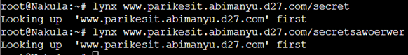

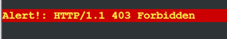
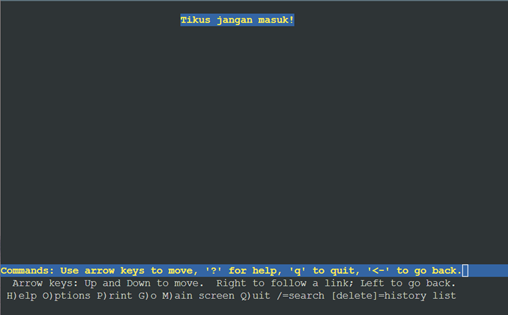


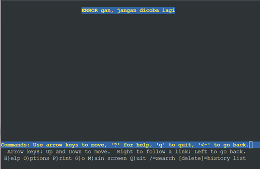

Kendala: tidak ada

----------------------------------------------------------------------------------------------------------------------------------
# No. 16
### Soal
Buatlah suatu konfigurasi virtual host agar file asset www.parikesit.
abimanyu.yyy.com/public/js menjadi 

www.parikesit.abimanyu.yyy.com/js 


### Penyelesaian
isi script no16:
```sh
#!/bin/bash

echo "<VirtualHost *:80>
        # The ServerName directive sets the request scheme, hostname and port that
        # the server uses to identify itself. This is used when creating
        # redirection URLs. In the context of virtual hosts, the ServerName
        # specifies what hostname must appear in the request's Host: header to
        # match this virtual host. For the default virtual host (this file) this
        # value is not decisive as it is used as a last resort host regardless.
        # However, you must set it for any further virtual host explicitly.
        #ServerName www.example.com

        ServerAdmin webmaster@localhost
        DocumentRoot /var/www/parikesit.abimanyu.d27
        ServerName parikesit.abimanyu.d27.com
        ServerAlias www.parikesit.abimanyu.d27.com

        <Directory /var/www/parikesit.abimanyu.d27/public>
                Options +Indexes
        </Directory>

        <Directory /var/www/parikesit.abimanyu.d27/public/css>
                Options -Indexes
        </Directory>

        <Directory /var/www/parikesit.abimanyu.d27/public/images>
                Options -Indexes
        </Directory>

        <Directory /var/www/parikesit.abimanyu.d27/public/js>
                Options -Indexes
        </Directory>

        <Directory /var/www/parikesit.abimanyu.d27/secret>
                Options -Indexes
        </Directory>

        <Directory /var/www/parikesit.abimanyu.d27>
                AllowOverride All
        </Directory>

        <Directory /var/www/parikesit.abimanyu.d27/public/js>
                Options +Indexes
        </Directory>

        Alias "/js" "/var/www/parikesit.abimanyu.d27/public/js"

        # Available loglevels: trace8, ..., trace1, debug, info, notice, warn,
        # error, crit, alert, emerg.
        # It is also possible to configure the loglevel for particular
        # modules, e.g.
        #LogLevel info ssl:warn

        ErrorLog \${APACHE_LOG_DIR}/error.log
        CustomLog \${APACHE_LOG_DIR}/access.log combined
        ErrorDocument 403 /error/403.html
        ErrorDocument 404 /error/404.html

        # For most configuration files from conf-available/, which are
        # enabled or disabled at a global level, it is possible to
        # include a line for only one particular virtual host. For example the
        # following line enables the CGI configuration for this host only
        # after it has been globally disabled with "a2disconf".
        #Include conf-available/serve-cgi-bin.conf
</VirtualHost>

# vim: syntax=apache ts=4 sw=4 sts=4 sr noet
" > /etc/apache2/sites-available/default-parikesit.conf

service apache2 restart
```
* cukup menambahkan line berikut pada virtualhost untuk mengaliaskan nama domain
```
Alias "/js" "/var/www/parikesit.abimanyu.d27/public/js"
```

### Output
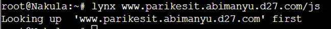

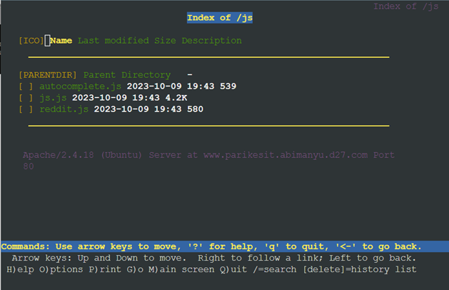

Kendala: tidak ada

----------------------------------------------------------------------------------------------------------------------------------
# No. 17
### Soal
Agar aman, buatlah konfigurasi agar www.rjp.baratayuda.abimanyu.yyy.com hanya dapat diakses melalui port 14000 dan 14400.

### Penyelesaian
isi script no17:
```sh
#!/bin/bash

echo "<VirtualHost *:80>
        # The ServerName directive sets the request scheme, hostname and port that
        # the server uses to identify itself. This is used when creating
        # redirection URLs. In the context of virtual hosts, the ServerName
        # specifies what hostname must appear in the request's Host: header to
        # match this virtual host. For the default virtual host (this file) this
        # value is not decisive as it is used as a last resort host regardless.
        # However, you must set it for any further virtual host explicitly.
        #ServerName www.example.com

        ServerAdmin webmaster@localhost
        DocumentRoot /var/www/parikesit.abimanyu.d27
        ServerName parikesit.abimanyu.d27.com
        ServerAlias www.parikesit.abimanyu.d27.com

        <Directory /var/www/parikesit.abimanyu.d27/public>
                Options +Indexes
        </Directory>

        <Directory /var/www/parikesit.abimanyu.d27/public/css>
                Options -Indexes
        </Directory>

        <Directory /var/www/parikesit.abimanyu.d27/public/images>
                Options -Indexes
        </Directory>

        <Directory /var/www/parikesit.abimanyu.d27/public/js>
                Options -Indexes
        </Directory>

        <Directory /var/www/parikesit.abimanyu.d27/secret>
                Options -Indexes
        </Directory>

        <Directory /var/www/parikesit.abimanyu.d27>
                AllowOverride All
        </Directory>

        <Directory /var/www/parikesit.abimanyu.d27/public/js>
                Options +Indexes
        </Directory>

        Alias "/js" "/var/www/parikesit.abimanyu.d27/public/js"

        # Available loglevels: trace8, ..., trace1, debug, info, notice, warn,
        # error, crit, alert, emerg.
        # It is also possible to configure the loglevel for particular
        # modules, e.g.
        #LogLevel info ssl:warn

        ErrorLog \${APACHE_LOG_DIR}/error.log
        CustomLog \${APACHE_LOG_DIR}/access.log combined
        ErrorDocument 403 /error/403.html
        ErrorDocument 404 /error/404.html

        # For most configuration files from conf-available/, which are
        # enabled or disabled at a global level, it is possible to
        # include a line for only one particular virtual host. For example the
        # following line enables the CGI configuration for this host only
        # after it has been globally disabled with "a2disconf".
        #Include conf-available/serve-cgi-bin.conf
</VirtualHost>

# vim: syntax=apache ts=4 sw=4 sts=4 sr noet
" > /etc/apache2/sites-available/default-parikesit.conf

service apache2 restart
root@Abimanyu:~# bash no16.sh 
 * Restarting Apache httpd web server apache2                                   AH00112: Warning: DocumentRoot [/var/www/html] does not exist
AH00558: apache2: Could not reliably determine the server's fully qualified domain name, using 127.0.1.1. Set the 'ServerName' directive globally to suppress this message
                                                                         [ OK ]
root@Abimanyu:~# cat no17.sh 
#!/bin/bash

touch /etc/apache2/sites-available/default-baratayuda.conf

echo "<VirtualHost *:14000>
        # The ServerName directive sets the request scheme, hostname and port that
        # the server uses to identify itself. This is used when creating
        # redirection URLs. In the context of virtual hosts, the ServerName
        # specifies what hostname must appear in the request's Host: header to
        # match this virtual host. For the default virtual host (this file) this
        # value is not decisive as it is used as a last resort host regardless.
        # However, you must set it for any further virtual host explicitly.
        #ServerName www.example.com

        ServerAdmin webmaster@localhost
        DocumentRoot /var/www/rjp.baratayuda.abimanyu.d27
        ServerName rjp.baratayuda.abimanyu.d27.com
        ServerAlias www.rjp.baratayuda.abimanyu.d27.com

        # Available loglevels: trace8, ..., trace1, debug, info, notice, warn,
        # error, crit, alert, emerg.
        # It is also possible to configure the loglevel for particular
        # modules, e.g.
        #LogLevel info ssl:warn

        ErrorLog \${APACHE_LOG_DIR}/error.log
        CustomLog \${APACHE_LOG_DIR}/access.log combined

        # For most configuration files from conf-available/, which are
        # enabled or disabled at a global level, it is possible to
        # include a line for only one particular virtual host. For example the
        # following line enables the CGI configuration for this host only
        # after it has been globally disabled with "a2disconf".
        #Include conf-available/serve-cgi-bin.conf
</VirtualHost>

<VirtualHost *:14400>
        # The ServerName directive sets the request scheme, hostname and port that
        # the server uses to identify itself. This is used when creating
        # redirection URLs. In the context of virtual hosts, the ServerName
        # specifies what hostname must appear in the request's Host: header to
        # match this virtual host. For the default virtual host (this file) this
        # value is not decisive as it is used as a last resort host regardless.
        # However, you must set it for any further virtual host explicitly.
        #ServerName www.example.com

        ServerAdmin webmaster@localhost
        DocumentRoot /var/www/rjp.baratayuda.abimanyu.d27
        ServerName rjp.baratayuda.abimanyu.d27.com
        ServerAlias www.rjp.baratayuda.abimanyu.d27.com

        # Available loglevels: trace8, ..., trace1, debug, info, notice, warn,
        # error, crit, alert, emerg.
        # It is also possible to configure the loglevel for particular
        # modules, e.g.
        #LogLevel info ssl:warn

        ErrorLog \${APACHE_LOG_DIR}/error.log
        CustomLog \${APACHE_LOG_DIR}/access.log combined

        # For most configuration files from conf-available/, which are
        # enabled or disabled at a global level, it is possible to
        # include a line for only one particular virtual host. For example the
        # following line enables the CGI configuration for this host only
        # after it has been globally disabled with "a2disconf".
        #Include conf-available/serve-cgi-bin.conf
</VirtualHost>

# vim: syntax=apache ts=4 sw=4 sts=4 sr noet
" > /etc/apache2/sites-available/default-baratayuda.conf

echo "
# If you just change the port or add more ports here, you will likely also
# have to change the VirtualHost statement in
# /etc/apache2/sites-enabled/000-default.conf

Listen 80
Listen 14000
Listen 14400

<IfModule ssl_module>
        Listen 443
</IfModule>

<IfModule mod_gnutls.c>
        Listen 443
</IfModule>

# vim: syntax=apache ts=4 sw=4 sts=4 sr noet
" > /etc/apache2/ports.conf

a2ensite default-baratayuda.conf

service apache2 restart

mkdir /var/www/rjp.baratayuda.abimanyu.d27

# URL and destination path
url="https://drive.google.com/uc?export=download&id=1sm-jMthB8Ym155F6ta9XbfXRoTZSIoEE"
dest="/var/www/rjp.baratayuda.abimanyu.d27/btyd.zip"

# Download the file
wget -O "$dest" "$url"

# Check if the file exists and has a non-zero size
while [ ! -s "$dest" ]
do
  sleep 5  # Wait for 5 seconds and check again
done

# Once the file is downloaded and has content, unzip it
unzip "$dest" -d /var/www/rjp.baratayuda.abimanyu.d27

service apache2 restart
```
* menambahkan virtualhost untuk port 14000 dan 14400
* kedua virtualhost memiliki isi yang sama
* menambahkan `Listen 14000` dan `Listen 14400` pada `/etc/apache2/ports.conf`
* membuat direktori baru tempat source web berada di `/var/www/rjp.baratayuda.abimanyu.d27`
* melakukan download asset

### Output
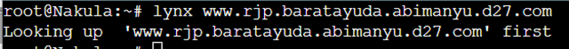
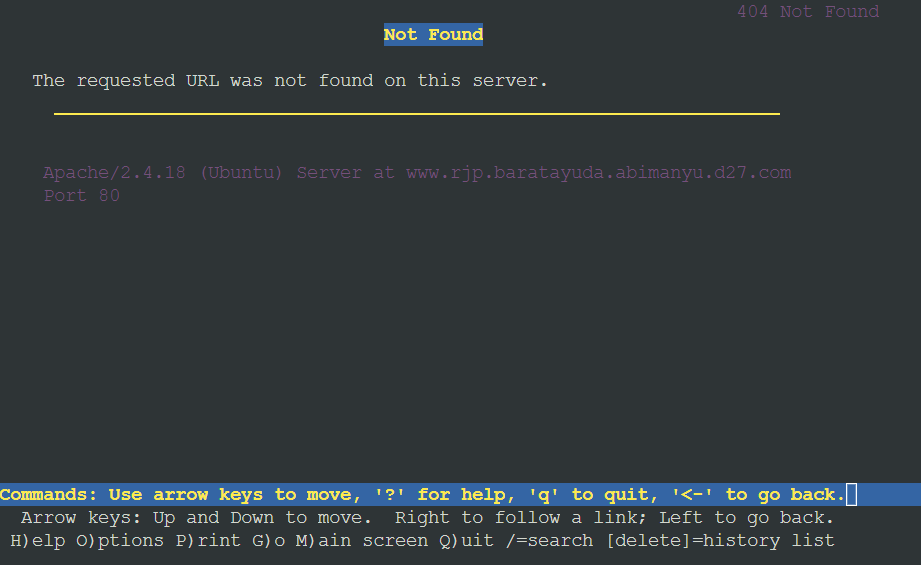

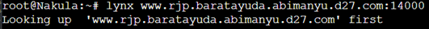
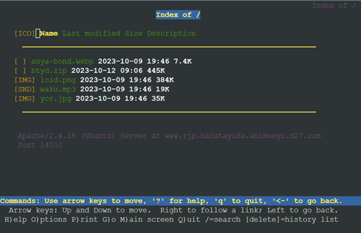

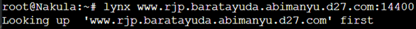
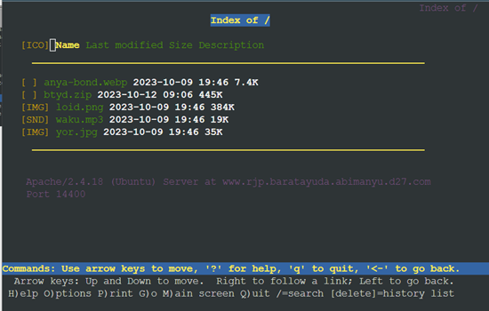


Kendala: tidak ada

----------------------------------------------------------------------------------------------------------------------------------
# No. 18
### Soal
Untuk mengaksesnya buatlah autentikasi username berupa “Wayang” dan password “baratayudayyy” dengan yyy merupakan kode kelompok. Letakkan DocumentRoot pada /var/www/rjp.baratayuda.abimanyu.yyy.

### Penyelesaian
isi script no18:
```sh
#!/bin/bash

touch /var/www/rjp.baratayuda.abimanyu.d27/.htaccess
echo "
AuthType Basic
AuthName \"Restricted Area\"
AuthUserFile /etc/apache2/.htpasswd
Require user Wayang
" > /var/www/rjp.baratayuda.abimanyu.d27/.htaccess

htpasswd -c -i -b /etc/apache2/.htpasswd Wayang baratayudad27

echo "
<VirtualHost *:14000>
        # The ServerName directive sets the request scheme, hostname and port that
        # the server uses to identify itself. This is used when creating
        # redirection URLs. In the context of virtual hosts, the ServerName
        # specifies what hostname must appear in the request's Host: header to
        # match this virtual host. For the default virtual host (this file) this
        # value is not decisive as it is used as a last resort host regardless.
        # However, you must set it for any further virtual host explicitly.
        #ServerName www.example.com

        ServerAdmin webmaster@localhost
        DocumentRoot /var/www/rjp.baratayuda.abimanyu.d27
        ServerName rjp.baratayuda.abimanyu.d27.com
        ServerAlias www.rjp.baratayuda.abimanyu.d27.com

        <Directory /var/www/rjp.baratayuda.abimanyu.d27>
                Options +FollowSymLinks
                AllowOverride All
                Order allow,deny
                allow from all
        </Directory>
 
        # Available loglevels: trace8, ..., trace1, debug, info, notice, warn,
        # error, crit, alert, emerg.
        # It is also possible to configure the loglevel for particular
        # modules, e.g.
        #LogLevel info ssl:warn

        ErrorLog \${APACHE_LOG_DIR}/error.log
        CustomLog \${APACHE_LOG_DIR}/access.log combined

        # For most configuration files from conf-available/, which are
        # enabled or disabled at a global level, it is possible to
        # include a line for only one particular virtual host. For example the
        # following line enables the CGI configuration for this host only
        # after it has been globally disabled with a2disconf.
        #Include conf-available/serve-cgi-bin.conf
</VirtualHost>

<VirtualHost *:14400>
        # The ServerName directive sets the request scheme, hostname and port that
        # the server uses to identify itself. This is used when creating
        # redirection URLs. In the context of virtual hosts, the ServerName
        # specifies what hostname must appear in the request's Host: header to
        # match this virtual host. For the default virtual host (this file) this
        # value is not decisive as it is used as a last resort host regardless.
        # However, you must set it for any further virtual host explicitly.
        #ServerName www.example.com

        ServerAdmin webmaster@localhost
        DocumentRoot /var/www/rjp.baratayuda.abimanyu.d27
        ServerName rjp.baratayuda.abimanyu.d27.com
        ServerAlias www.rjp.baratayuda.abimanyu.d27.com

        <Directory /var/www/rjp.baratayuda.abimanyu.d27>
                Options +FollowSymLinks
                AllowOverride All
                Order allow,deny
                allow from all
        </Directory>

        # Available loglevels: trace8, ..., trace1, debug, info, notice, warn,
        # error, crit, alert, emerg.
        # It is also possible to configure the loglevel for particular
        # modules, e.g.
        #LogLevel info ssl:warn

        ErrorLog \${APACHE_LOG_DIR}/error.log
        CustomLog \${APACHE_LOG_DIR}/access.log combined

        # For most configuration files from conf-available/, which are
        # enabled or disabled at a global level, it is possible to
        # include a line for only one particular virtual host. For example the
        # following line enables the CGI configuration for this host only
        # after it has been globally disabled with a2disconf.
        #Include conf-available/serve-cgi-bin.conf
</VirtualHost>
" > /etc/apache2/sites-available/default-baratayuda.conf

a2enmod auth_basic authn_core authn_file

a2ensite default-baratayuda.conf

service apache2 restart
```
* menambahkan `.htaccess` ke direktori `/var/www/rjp.baratayuda.d27/`
* mengisi `.htaccess` dengan konfig autentikasi sebagai berikut
```
AuthType Basic
AuthName \"Restricted Area\"
AuthUserFile /etc/apache2/.htpasswd
Require user Wayang
```
* menambahkan username dan password yang digunakan untuk autentikasi
`htpasswd -c -i -b /etc/apache2/.htpasswd Wayang baratayudad27`
* menambahkan sedikit konfig ke virtualhost port 14000 dan 14400
```
        <Directory /var/www/rjp.baratayuda.abimanyu.d27>
                Options +FollowSymLinks
                AllowOverride All
                Order allow,deny
                allow from all
        </Directory>
```

### Output
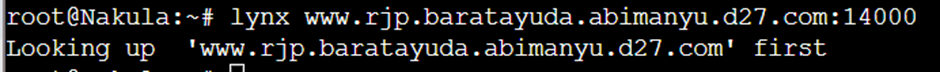

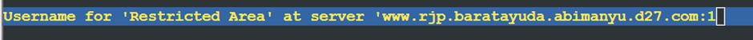

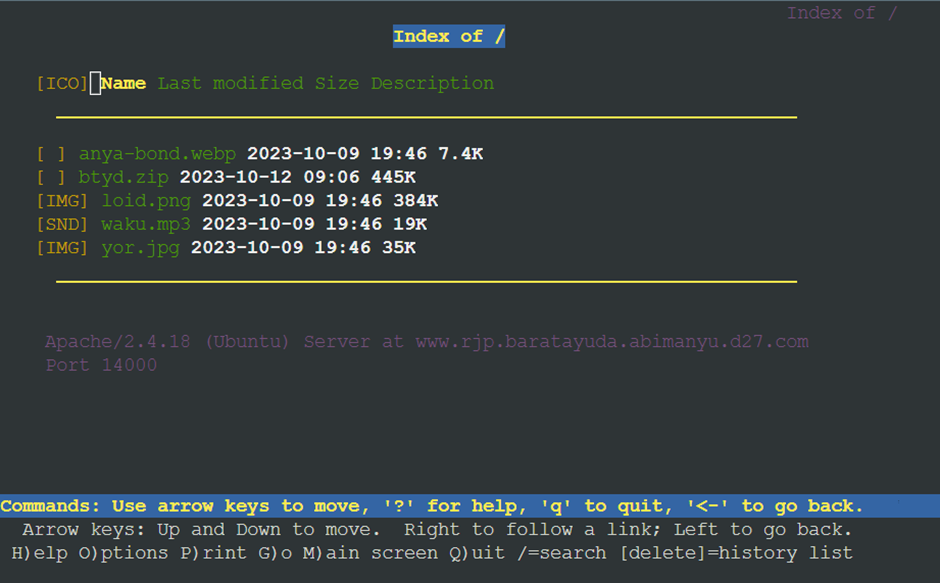

Kendala: tidak ada

----------------------------------------------------------------------------------------------------------------------------------
# No. 19
### Soal
Buatlah agar setiap kali mengakses IP dari Abimanyu akan secara otomatis dialihkan ke www.abimanyu.yyy.com (alias)

### Penyelesaian
isi script no19:
```sh
#!/bin/bash

echo "<VirtualHost *:80>
        # The ServerName directive sets the request scheme, hostname and port that
        # the server uses to identify itself. This is used when creating
        # redirection URLs. In the context of virtual hosts, the ServerName
        # specifies what hostname must appear in the request's Host: header to
        # match this virtual host. For the default virtual host (this file) this
        # value is not decisive as it is used as a last resort host regardless.
        # However, you must set it for any further virtual host explicitly.
        #ServerName www.example.com

        ServerAdmin webmaster@localhost
        DocumentRoot /var/www/abimanyu.d27
        ServerName abimanyu.d27.com
        ServerAlias www.abimanyu.d27.com

        <Directory /var/www/abimanyu.d27>
                Options +FollowSymLinks -Multiviews
                AllowOverride All
        </Directory>

        # Available loglevels: trace8, ..., trace1, debug, info, notice, warn,
        # error, crit, alert, emerg.
        # It is also possible to configure the loglevel for particular
        # modules, e.g.
        #LogLevel info ssl:warn

        ErrorLog \${APACHE_LOG_DIR}/error.log
        CustomLog \${APACHE_LOG_DIR}/access.log combined

        # For most configuration files from conf-available/, which are
        # enabled or disabled at a global level, it is possible to
        # include a line for only one particular virtual host. For example the
        # following line enables the CGI configuration for this host only
        # after it has been globally disabled with a2disconf.
        #Include conf-available/serve-cgi-bin.conf
</VirtualHost>

<VirtualHost *:80>
    ServerName 10.35.3.3
    Redirect permanent / http://www.abimanyu.d27.com
</VirtualHost>


# vim: syntax=apache ts=4 sw=4 sts=4 sr noet
" > /etc/apache2/sites-available/default-8002.conf

a2ensite default-8002.conf      # sitesavailable milik abimanyu.d27.com
service apache2 restart
```
* menambahkan virtualhost baru dengan port yang sama sebagai berikut
```
<VirtualHost *:80>
    ServerName 10.35.3.3
    Redirect permanent / http://www.abimanyu.d27.com
</VirtualHost>
```

### Output
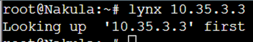


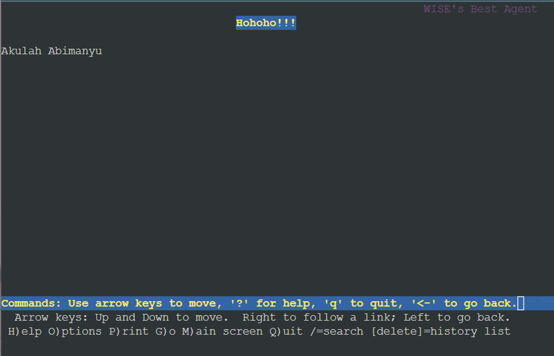

Kendala: tidak ada

----------------------------------------------------------------------------------------------------------------------------------
# No. 20
### Soal
Karena website www.parikesit.abimanyu.yyy.com semakin banyak pengunjung dan banyak gambar gambar random, maka ubahlah request gambar yang memiliki substring “abimanyu” akan diarahkan menuju abimanyu.png.

### Penyelesaian
isi script no20:
```sh
#!/bin/bash

a2enmod rewrite

service apache2 restart

touch /var/www/parikesit.abimanyu.d27/public/images/.htaccess
echo "
RewriteEngine On
RewriteCond %{REQUEST_URI} ^/public/images/(.*)abimanyu(.*)
RewriteCond %{REQUEST_URI} !/public/images/abimanyu.png
RewriteRule abimanyu http://parikesit.abimanyu.d27.com/public/images/abimanyu.png\$1 [L,R=301]
" > /var/www/parikesit.abimanyu.d27/public/images/.htaccess

service apache2 restart
```
* menambahkan `RewriteCond` dan `RewriteRule` untuk `.htaccess`

### Output
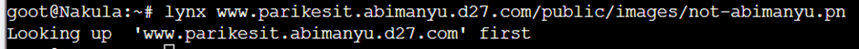
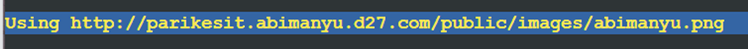
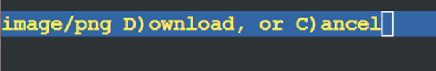


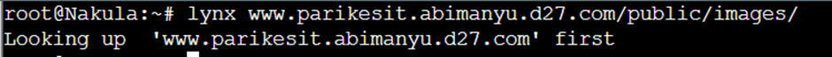
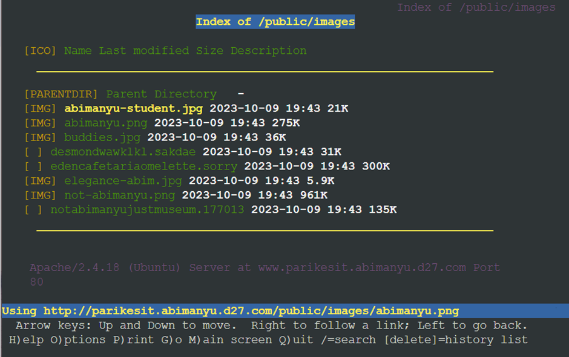
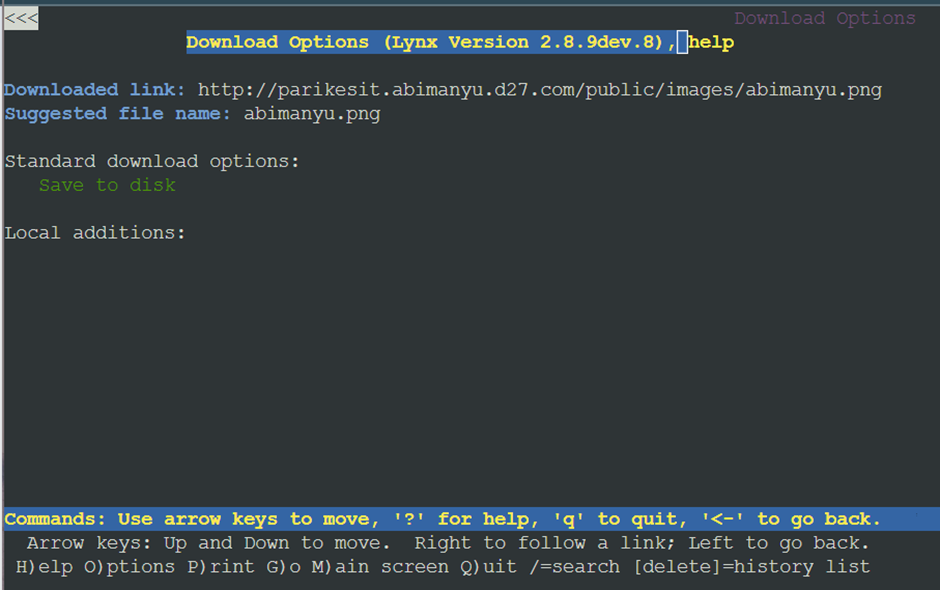

Kendala: tidak ada

