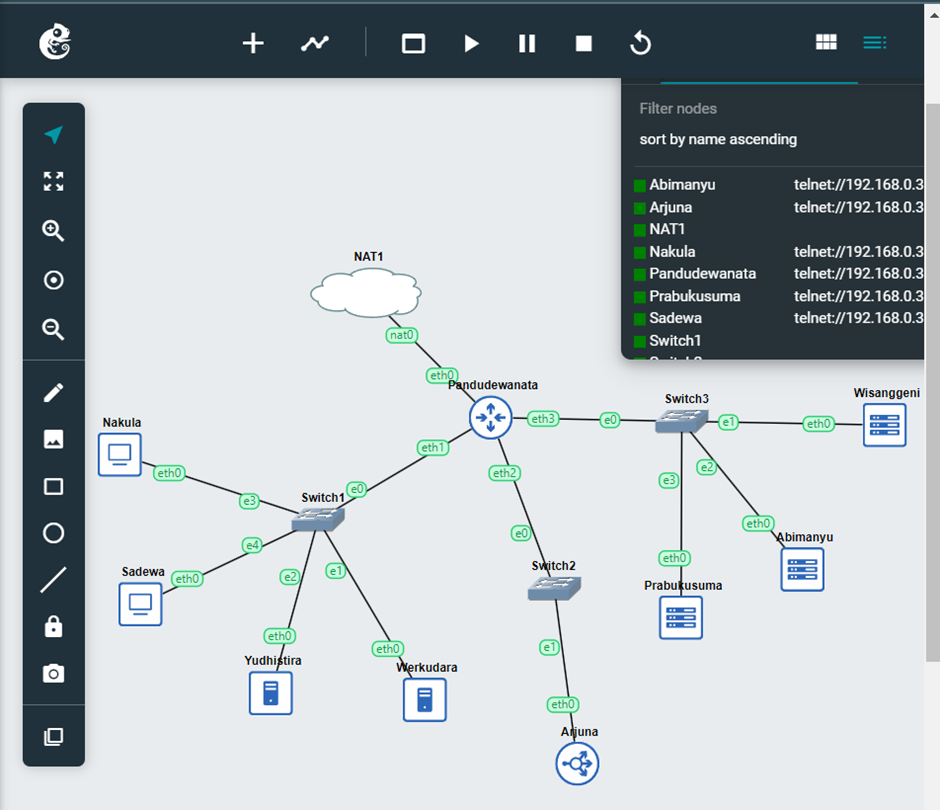

# Jarkom-Modul-2-D27-2023

Anggota Kelompok Jarkom D27:
* Duevano Fairuz Pandya (5025211052)
* Choirul Rijal Dawam Iba (5025211206)

# No. 1
### Soal
Yudhistira akan digunakan sebagai DNS Master, Werkudara sebagai DNS Slave, Arjuna merupakan Load Balancer yang terdiri dari beberapa Web Server yaitu Prabakusuma, Abimanyu, dan Wisanggeni. Buatlah topologi dengan pembagian sebagai berikut. Folder topologi dapat diakses pada drive berikut 

### Penyelesaian

Kendala: 

----------------------------------------------------------------------------------------------------------------------------------
# No. 2
### Soal
Buatlah website utama pada node arjuna dengan akses ke arjuna.yyy.com dengan alias www.arjuna.yyy.com dengan yyy merupakan kode kelompok.

### Penyelesaian

Kendala:

----------------------------------------------------------------------------------------------------------------------------------
# No. 3
### Soal
Dengan cara yang sama seperti soal nomor 2, buatlah website utama dengan akses ke abimanyu.yyy.com dan alias www.abimanyu.yyy.com.

### Penyelesaian

Kendala: 

----------------------------------------------------------------------------------------------------------------------------------
# No. 4
### Soal
Kemudian, karena terdapat beberapa web yang harus di-deploy, buatlah subdomain parikesit.abimanyu.yyy.com yang diatur DNS-nya di Yudhistira dan mengarah ke Abimanyu.

### Penyelesaian

Kendala: 

----------------------------------------------------------------------------------------------------------------------------------
# No. 5
### Soal
Buat juga reverse domain untuk domain utama. (Abimanyu saja yang direverse)

### Penyelesaian

Kendala:

----------------------------------------------------------------------------------------------------------------------------------
# No. 6
### Soal
Agar dapat tetap dihubungi ketika DNS Server Yudhistira bermasalah, buat juga Werkudara sebagai DNS Slave untuk domain utama.

### Penyelesaian

Kendala:

----------------------------------------------------------------------------------------------------------------------------------
# No. 7
### Soal
Seperti yang kita tahu karena banyak sekali informasi yang harus diterima, buatlah subdomain khusus untuk perang yaitu baratayuda.abimanyu.yyy.com dengan alias www.baratayuda.abimanyu.yyy.com yang didelegasikan dari Yudhistira ke Werkudara dengan IP menuju ke Abimanyu dalam folder Baratayuda.

### Penyelesaian

Kendala: 

----------------------------------------------------------------------------------------------------------------------------------
# No. 8
### Soal
Untuk informasi yang lebih spesifik mengenai Ranjapan Baratayuda, buatlah subdomain melalui Werkudara dengan akses rjp.baratayuda.abimanyu.yyy.com dengan alias www.rjp.baratayuda.abimanyu.yyy.com yang mengarah ke Abimanyu.

### Penyelesaian

Kendala: 

----------------------------------------------------------------------------------------------------------------------------------
# No. 9
### Soal
Arjuna merupakan suatu Load Balancer Nginx dengan tiga worker (yang juga menggunakan nginx sebagai webserver) yaitu Prabakusuma, Abimanyu, dan Wisanggeni. Lakukan deployment pada masing-masing worker.

### Penyelesaian

Kendala:

----------------------------------------------------------------------------------------------------------------------------------
# No. 10
### Soal
Kemudian gunakan algoritma Round Robin untuk Load Balancer pada Arjuna. Gunakan server_name pada soal nomor 1. Untuk melakukan pengecekan akses alamat web tersebut kemudian pastikan worker yang digunakan untuk menangani permintaan akan berganti ganti secara acak. Untuk webserver di masing-masing worker wajib berjalan di port 8001-8003. Contoh
    - Prabakusuma:8001
    - Abimanyu:8002
    - Wisanggeni:8003

### Penyelesaian

Kendala:

----------------------------------------------------------------------------------------------------------------------------------
# No. 11
### Soal
Selain menggunakan Nginx, lakukan konfigurasi Apache Web Server pada worker Abimanyu dengan web server www.abimanyu.yyy.com. Pertama dibutuhkan web server dengan DocumentRoot pada /var/www/abimanyu.yyy

### Penyelesaian

Kendala:

----------------------------------------------------------------------------------------------------------------------------------
# No. 12
### Soal
Setelah itu ubahlah agar url www.abimanyu.yyy.com/index.php/home menjadi www.abimanyu.yyy.com/home.

### Penyelesaian

Kendala:

----------------------------------------------------------------------------------------------------------------------------------
# No. 13
### Soal
Selain itu, pada subdomain www.parikesit.abimanyu.yyy.com, DocumentRoot disimpan pada /var/www/parikesit.abimanyu.yyy

### Penyelesaian

Kendala:

----------------------------------------------------------------------------------------------------------------------------------
# No. 14
### Soal
Pada subdomain tersebut folder /public hanya dapat melakukan directory listing sedangkan pada folder /secret tidak dapat diakses (403 Forbidden).

### Penyelesaian

Kendala:

----------------------------------------------------------------------------------------------------------------------------------
# No. 15
### Soal
Buatlah kustomisasi halaman error pada folder /error untuk mengganti error kode pada Apache. Error kode yang perlu diganti adalah 404 Not Found dan 403 Forbidden.

### Penyelesaian

Kendala:

----------------------------------------------------------------------------------------------------------------------------------
# No. 16
### Soal
Buatlah suatu konfigurasi virtual host agar file asset www.parikesit.

abimanyu.yyy.com/public/js menjadi 

www.parikesit.abimanyu.yyy.com/js 

### Penyelesaian

Kendala:

----------------------------------------------------------------------------------------------------------------------------------
# No. 17
### Soal
Agar aman, buatlah konfigurasi agar www.rjp.baratayuda.abimanyu.yyy.com hanya dapat diakses melalui port 14000 dan 14400.

### Penyelesaian

Kendala:

----------------------------------------------------------------------------------------------------------------------------------
# No. 18
### Soal
Untuk mengaksesnya buatlah autentikasi username berupa “Wayang” dan password “baratayudayyy” dengan yyy merupakan kode kelompok. Letakkan DocumentRoot pada /var/www/rjp.baratayuda.abimanyu.yyy.

### Penyelesaian

Kendala:

----------------------------------------------------------------------------------------------------------------------------------
# No. 19
### Soal
Buatlah agar setiap kali mengakses IP dari Abimanyu akan secara otomatis dialihkan ke www.abimanyu.yyy.com (alias)

### Penyelesaian

Kendala:

----------------------------------------------------------------------------------------------------------------------------------
# No. 20
### Soal
Karena website www.parikesit.abimanyu.yyy.com semakin banyak pengunjung dan banyak gambar gambar random, maka ubahlah request gambar yang memiliki substring “abimanyu” akan diarahkan menuju abimanyu.png.

### Penyelesaian

Kendala:

