# Jarkom-Modul-2-D27-2023

Anggota Kelompok Jarkom D27:
* Duevano Fairuz Pandya (5025211052)
* Choirul Rijal Dawam Iba (5025211206)

----------------------------------------------------------------------------------------------------------------------------------
**PREFIX: 10.35.X.X**

LOKASI SHELL SCRIPT / KONFIGURASI TIAP NOMOR:
1. topologi
2. node Yudhistira
3. node Yudhistira
4. node Yudhistira
5. node Yudhistira
6. node Yudhistira, node Werkudara
7. node Yudhistira, node Werkudara
8. node Werkudara
9. node Arjuna, node Prabukusuma, node Abimanyu, node Wisanggeni 
10. node Arjuna, node Prabukusuma, node Abimanyu, node Wisanggeni
11. node Abimanyu
12. node Abimanyu
13. node Abimanyu, node Yudhistira
14. node Abimanyu
15. node Abimanyu
16. node Abimanyu
17. node Abimanyu
18. node Abimanyu
19. node Abimanyu
20. node Abimanyu


----------------------------------------------------------------------------------------------------------------------------------
Revisi:
* hapus default page nginx dan apache2
* no9: di arjuna ditambahi servername 
* no11 keatas: apache2 set ke port 80 tok
* no14: dalam public harusnya gabisa diakses


----------------------------------------------------------------------------------------------------------------------------------
# No. 1
### Soal
Yudhistira akan digunakan sebagai DNS Master, Werkudara sebagai DNS Slave, Arjuna merupakan Load Balancer yang terdiri dari beberapa Web Server yaitu Prabakusuma, Abimanyu, dan Wisanggeni. Buatlah topologi dengan pembagian sebagai berikut. Folder topologi dapat diakses pada drive berikut 

### Penyelesaian

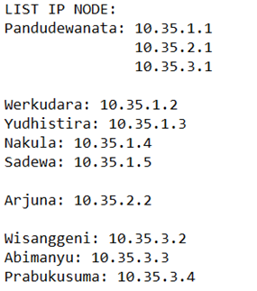
-tambahin penjelasan singkat jal-

Kendala: tidak ada

----------------------------------------------------------------------------------------------------------------------------------
# No. 2
### Soal
Buatlah website utama pada node arjuna dengan akses ke arjuna.yyy.com dengan alias www.arjuna.yyy.com dengan yyy merupakan kode kelompok.

### Penyelesaian
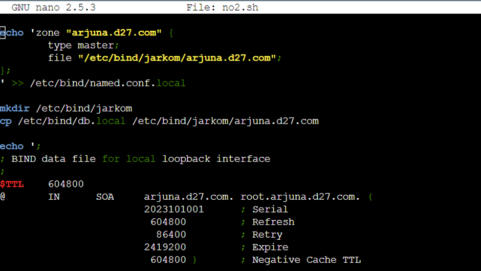
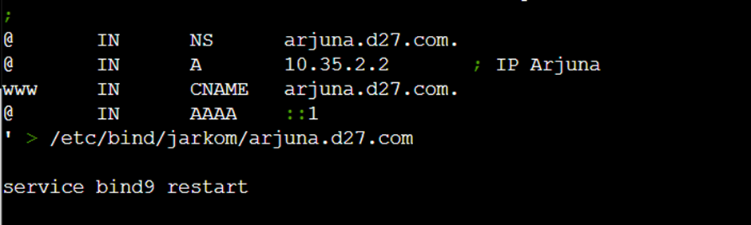
-tambahin penjelasan singkat jal-

### Output
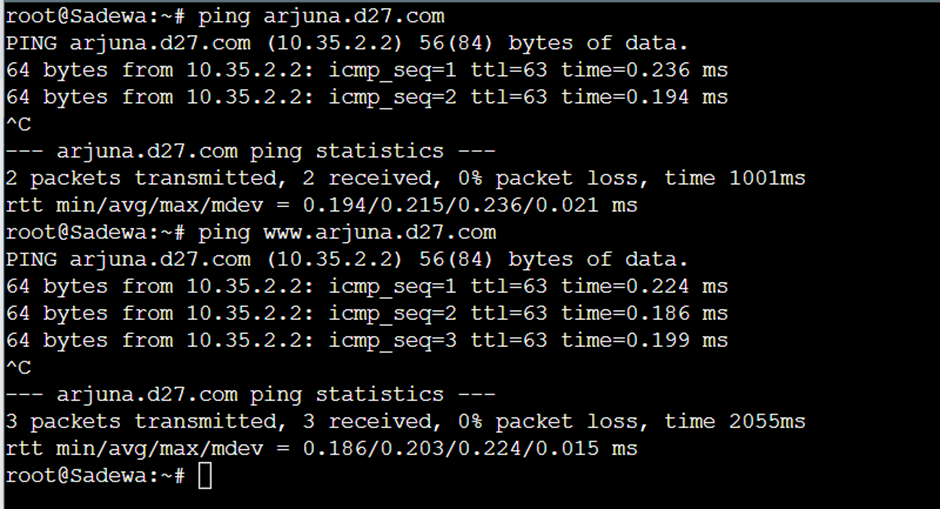
-tambahin penjelasan singkat jal-

Kendala:


----------------------------------------------------------------------------------------------------------------------------------
# No. 3
### Soal
Dengan cara yang sama seperti soal nomor 2, buatlah website utama dengan akses ke abimanyu.yyy.com dan alias www.abimanyu.yyy.com.

### Penyelesaian
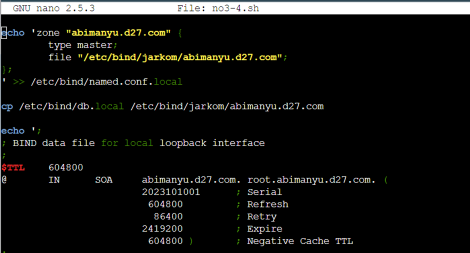

-tambahin penjelasan singkat jal-

### Output
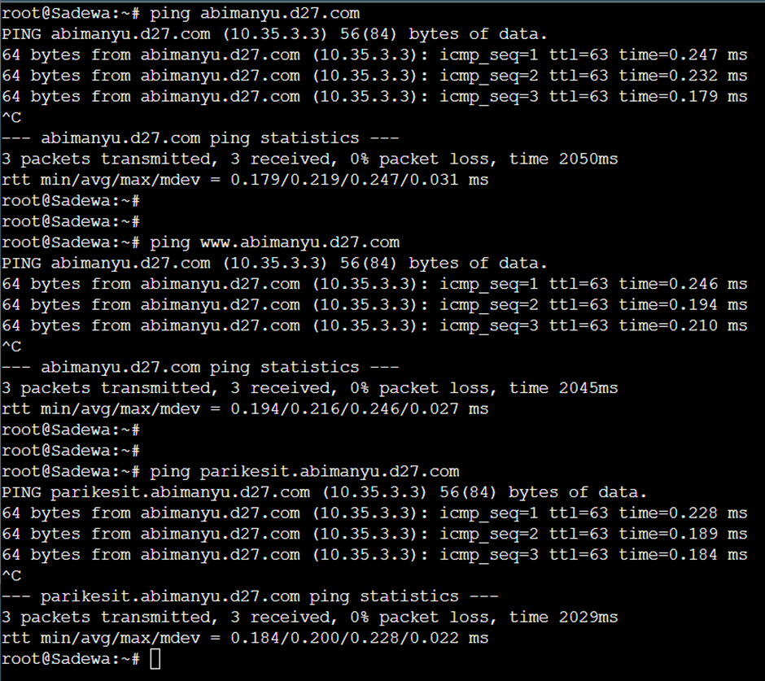
-tambahin penjelasan singkat jal-

Kendala: 

----------------------------------------------------------------------------------------------------------------------------------
# No. 4
### Soal
Kemudian, karena terdapat beberapa web yang harus di-deploy, buatlah subdomain parikesit.abimanyu.yyy.com yang diatur DNS-nya di Yudhistira dan mengarah ke Abimanyu.

### Penyelesaian

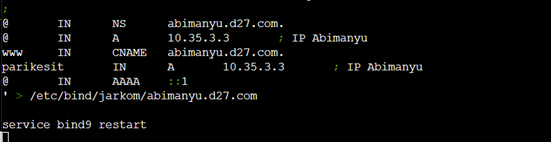
-tambahin penjelasan singkat jal-

### Output

-tambahin penjelasan singkat jal-

Kendala: 

----------------------------------------------------------------------------------------------------------------------------------
# No. 5
### Soal
Buat juga reverse domain untuk domain utama. (Abimanyu saja yang direverse)

### Penyelesaian
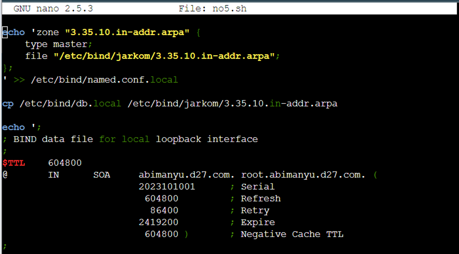
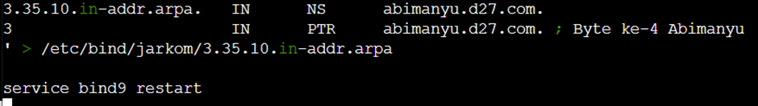

* Kita lakukan pengaturan konfig di node Yudhistira,
* echo yang pertama digunakan untuk mengatur konfig deklarasi dns di `/etc/bind/named.conf.local`
* cp `/etc/bind/db.local` sebagai template bind konfig reverse domain abimanyu.d27.com (`3.35.10.in-addr.arpa`)

### Output
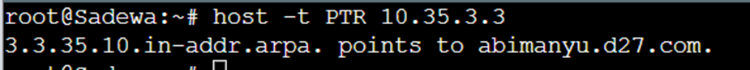

Kendala: tidak ada


----------------------------------------------------------------------------------------------------------------------------------
# No. 6
### Soal
Agar dapat tetap dihubungi ketika DNS Server Yudhistira bermasalah, buat juga Werkudara sebagai DNS Slave untuk domain utama.

### Penyelesaian
Untuk nomor 6, script penyelesaian dibuat di node Yudhistira dan Werkudara.

Node Yudhistira:

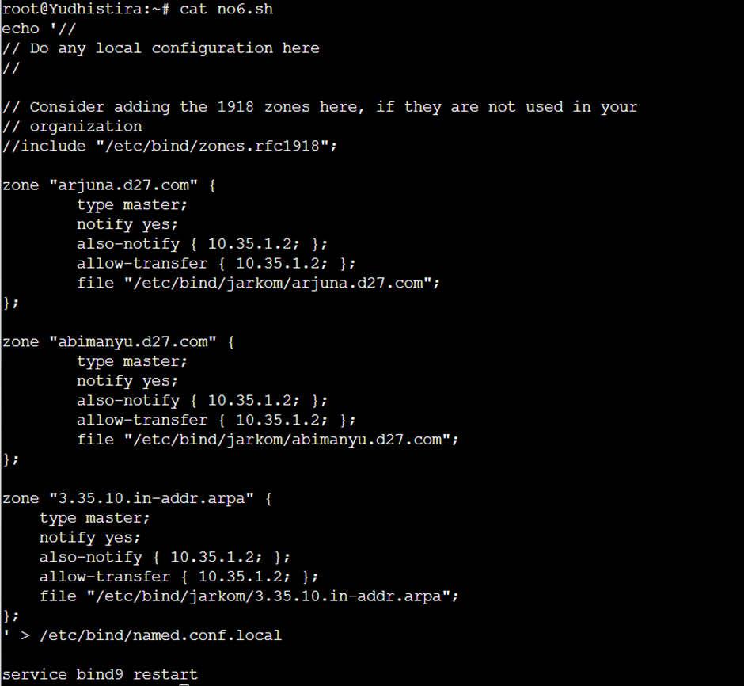

Node Werkudara:

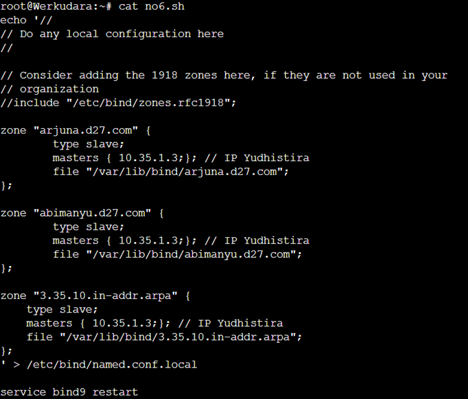

* konfigurasi di atas dilakukan untuk membuat dns yudhistira sebagai master dan werkudara sebagai slave nya
* pada yudhistira terdapat tambahan 
```
        type master;
        notify yes;
        also-notify { 10.35.1.2; }; 
        allow-transfer { 10.35.1.2; };
```
* dan apda werkudara terdapat tambahan 
```
        type slave;
        masters { 10.35.1.3;}; // IP Yudhistira
```

### Output
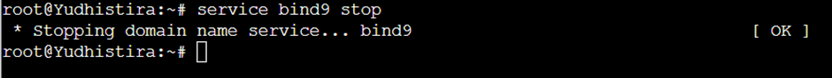
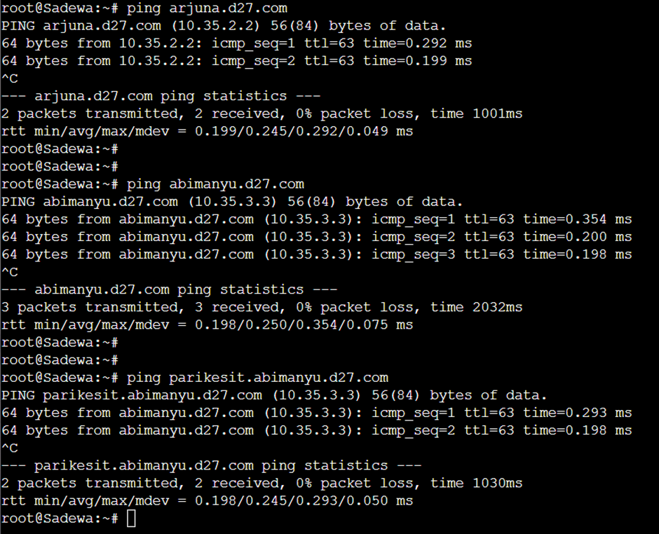

Kendala: tidak ada


----------------------------------------------------------------------------------------------------------------------------------
# No. 7
### Soal
Seperti yang kita tahu karena banyak sekali informasi yang harus diterima, buatlah subdomain khusus untuk perang yaitu baratayuda.abimanyu.yyy.com dengan alias www.baratayuda.abimanyu.yyy.com yang didelegasikan dari Yudhistira ke Werkudara dengan IP menuju ke Abimanyu dalam folder Baratayuda.

### Penyelesaian
Untuk melakukan delegasi nama domain diperlukan konfig untuk dua node yang ingin disambungkan. Konfigurasi dibuat di node Yudhistira dan Werkudara

Node Yudhistira:

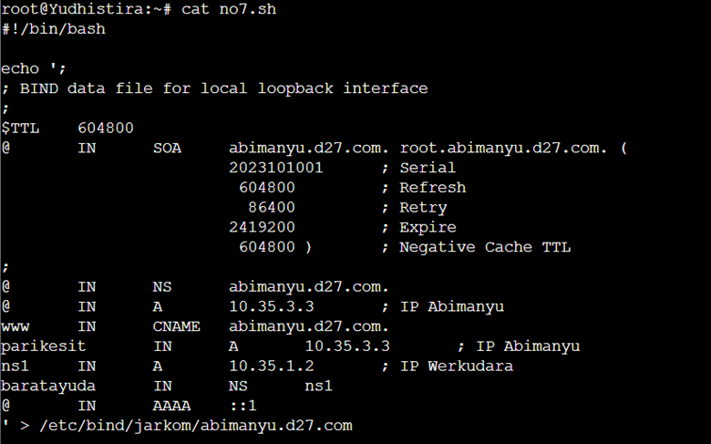
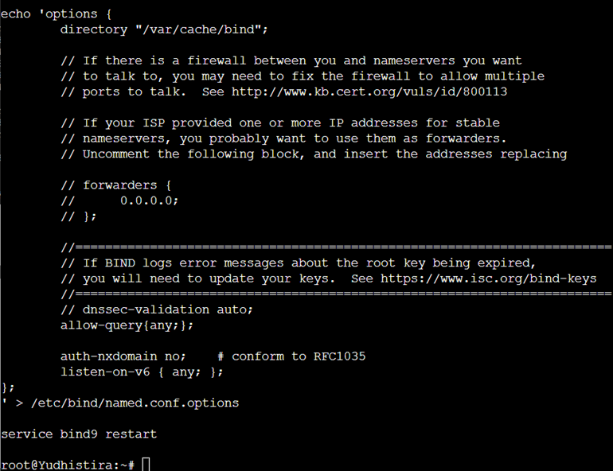

Node Werkudara:

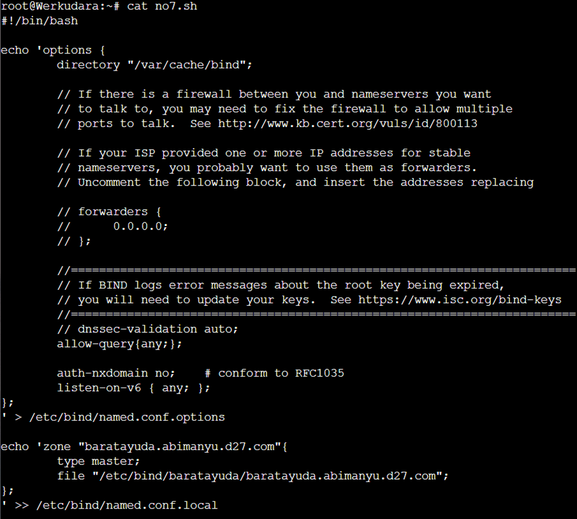
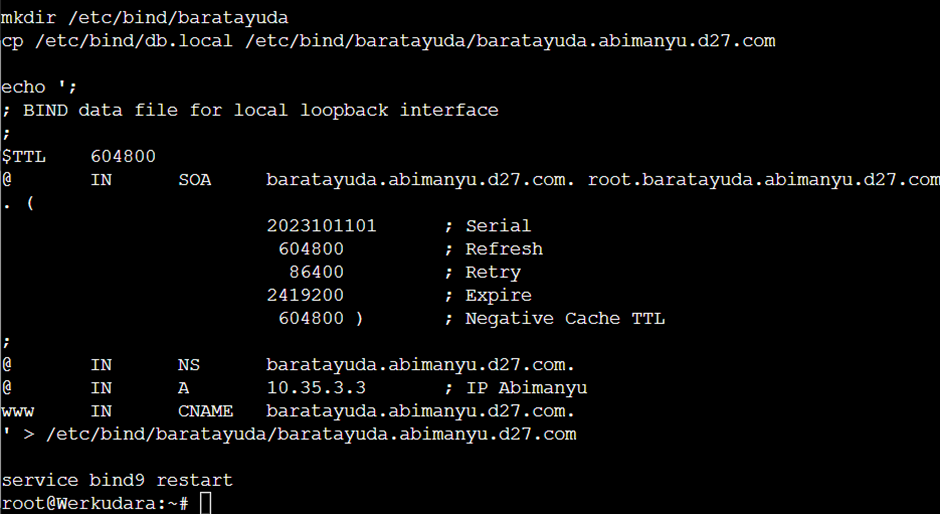

* pendelegasian dilakukan dengan cara menambahkan 
```
ns1     IN      A       10.35.1.2       ; IP Werkudara
baratayuda      IN      NS      ns1
```
* dan dilakukan konfig berikut pada `/etc/bind/named.conf.options`
```
        // dnssec-validation auto;
        allow-query{any;};
``` 
* selain itu pada node werkudara juga ditambahkan konfig deklarasi dns `baratayuda.abimanyu.d27.com` dengan tipe master, dan konfig bind nya juga sebagaimana pembuatan domain biasanya


### Output
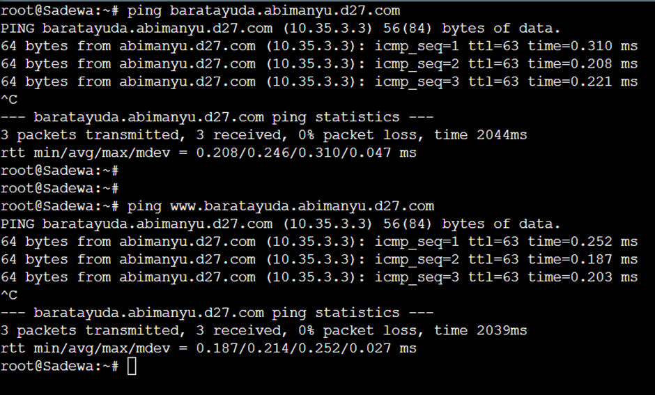

Kendala: tidak ada

----------------------------------------------------------------------------------------------------------------------------------
# No. 8
### Soal
Untuk informasi yang lebih spesifik mengenai Ranjapan Baratayuda, buatlah subdomain melalui Werkudara dengan akses rjp.baratayuda.abimanyu.yyy.com dengan alias www.rjp.baratayuda.abimanyu.yyy.com yang mengarah ke Abimanyu.

### Penyelesaian

### Output

Kendala: 


----------------------------------------------------------------------------------------------------------------------------------
# No. 9
### Soal
Arjuna merupakan suatu Load Balancer Nginx dengan tiga worker (yang juga menggunakan nginx sebagai webserver) yaitu Prabakusuma, Abimanyu, dan Wisanggeni. Lakukan deployment pada masing-masing worker.

### Penyelesaian

### Output

Kendala:


----------------------------------------------------------------------------------------------------------------------------------
# No. 10
### Soal
Kemudian gunakan algoritma Round Robin untuk Load Balancer pada Arjuna. Gunakan server_name pada soal nomor 1. Untuk melakukan pengecekan akses alamat web tersebut kemudian pastikan worker yang digunakan untuk menangani permintaan akan berganti ganti secara acak. Untuk webserver di masing-masing worker wajib berjalan di port 8001-8003. Contoh
    - Prabakusuma:8001
    - Abimanyu:8002
    - Wisanggeni:8003

### Penyelesaian

### Output

Kendala:

----------------------------------------------------------------------------------------------------------------------------------
# No. 11
### Soal
Selain menggunakan Nginx, lakukan konfigurasi Apache Web Server pada worker Abimanyu dengan web server www.abimanyu.yyy.com. Pertama dibutuhkan web server dengan DocumentRoot pada /var/www/abimanyu.yyy

### Penyelesaian

### Output

Kendala:

----------------------------------------------------------------------------------------------------------------------------------
# No. 12
### Soal
Setelah itu ubahlah agar url www.abimanyu.yyy.com/index.php/home menjadi www.abimanyu.yyy.com/home.

### Penyelesaian

### Output

Kendala:

----------------------------------------------------------------------------------------------------------------------------------
# No. 13
### Soal
Selain itu, pada subdomain www.parikesit.abimanyu.yyy.com, DocumentRoot disimpan pada /var/www/parikesit.abimanyu.yyy

### Penyelesaian

### Output

Kendala:

----------------------------------------------------------------------------------------------------------------------------------
# No. 14
### Soal
Pada subdomain tersebut folder /public hanya dapat melakukan directory listing sedangkan pada folder /secret tidak dapat diakses (403 Forbidden).

### Penyelesaian

### Output

Kendala:

----------------------------------------------------------------------------------------------------------------------------------
# No. 15
### Soal
Buatlah kustomisasi halaman error pada folder /error untuk mengganti error kode pada Apache. Error kode yang perlu diganti adalah 404 Not Found dan 403 Forbidden.

### Penyelesaian

### Output

Kendala:

----------------------------------------------------------------------------------------------------------------------------------
# No. 16
### Soal
Buatlah suatu konfigurasi virtual host agar file asset www.parikesit.
abimanyu.yyy.com/public/js menjadi 

www.parikesit.abimanyu.yyy.com/js 


### Penyelesaian

### Output

Kendala:

----------------------------------------------------------------------------------------------------------------------------------
# No. 17
### Soal
Agar aman, buatlah konfigurasi agar www.rjp.baratayuda.abimanyu.yyy.com hanya dapat diakses melalui port 14000 dan 14400.

### Penyelesaian

### Output

Kendala:

----------------------------------------------------------------------------------------------------------------------------------
# No. 18
### Soal
Untuk mengaksesnya buatlah autentikasi username berupa “Wayang” dan password “baratayudayyy” dengan yyy merupakan kode kelompok. Letakkan DocumentRoot pada /var/www/rjp.baratayuda.abimanyu.yyy.

### Penyelesaian

### Output

Kendala:

----------------------------------------------------------------------------------------------------------------------------------
# No. 19
### Soal
Buatlah agar setiap kali mengakses IP dari Abimanyu akan secara otomatis dialihkan ke www.abimanyu.yyy.com (alias)

### Penyelesaian

### Output

Kendala:

----------------------------------------------------------------------------------------------------------------------------------
# No. 20
### Soal
Karena website www.parikesit.abimanyu.yyy.com semakin banyak pengunjung dan banyak gambar gambar random, maka ubahlah request gambar yang memiliki substring “abimanyu” akan diarahkan menuju abimanyu.png.

### Penyelesaian

### Output

Kendala:

